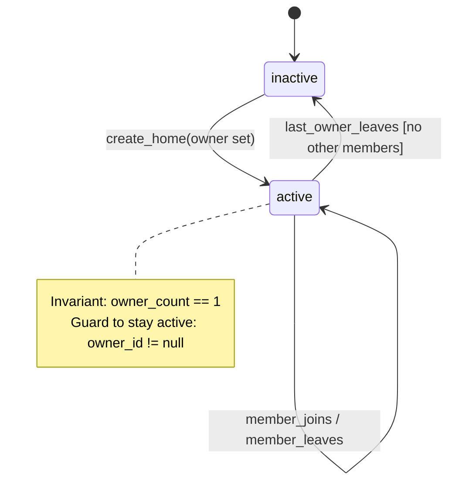

```mermaid
stateDiagram-v2
  [*] --> inactive

  inactive --> active: create_home(owner set)
  active --> inactive: last_owner_leaves [no other members]
  active --> active: transfer_owner [new_owner set]
  active --> active: member_joins / member_leaves

  note right of active
    Invariant: owner_count == 1
    Guard to stay active: owner_id != null
  end note
```

