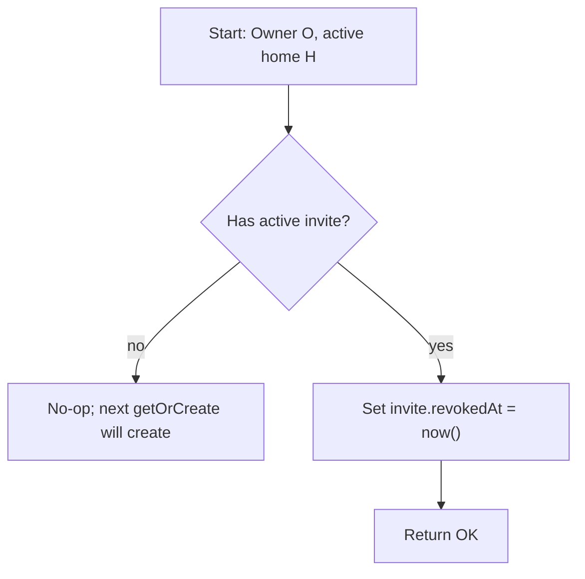

```mermaid

flowchart TD
  A[Start: Owner O, active home H] --> B{Has active invite?}
  B -- no --> C[No-op; next getOrCreate will create]
  B -- yes --> D["Set invite.revokedAt = now()"]
  D --> E[Return OK]

```
