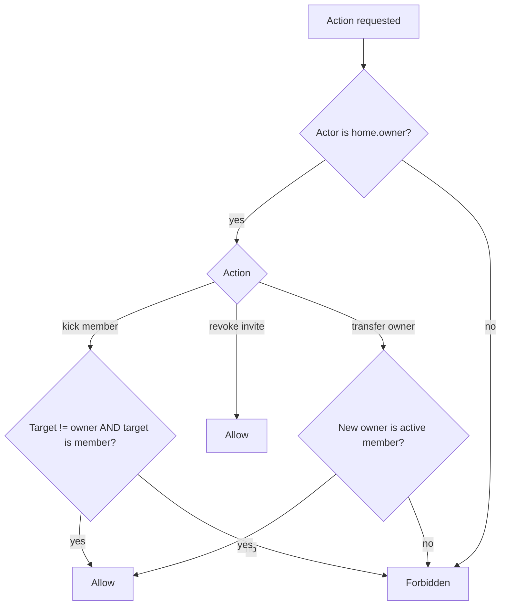

```mermaid
flowchart TD
  A[Action requested] --> B{Actor is home.owner?}
  B -- yes --> C{Action}
  B -- no --> D[Forbidden]

  C -->|kick member| E{Target != owner AND target is member?}
  E -- yes --> F[Allow]
  E -- no --> D

  C -->|revoke invite| G[Allow]
  C -->|transfer owner| H{New owner is active member?}
  H -- yes --> F
  H -- no --> D
```

