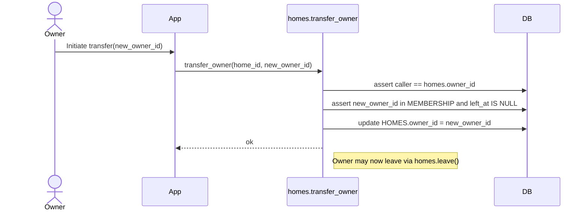

```mermaid
sequenceDiagram
  actor Owner
  participant App
  participant RPC as homes.transfer_owner
  participant DB

  Owner->>App: Initiate transfer(new_owner_id)
  App->>RPC: transfer_owner(home_id, new_owner_id)
  RPC->>DB: assert caller == homes.owner_id
  RPC->>DB: assert new_owner_id in MEMBERSHIP and left_at IS NULL
  RPC->>DB: update HOMES.owner_id = new_owner_id
  RPC-->>App: ok
  Note right of RPC: Owner may now leave via homes.leave()
```

