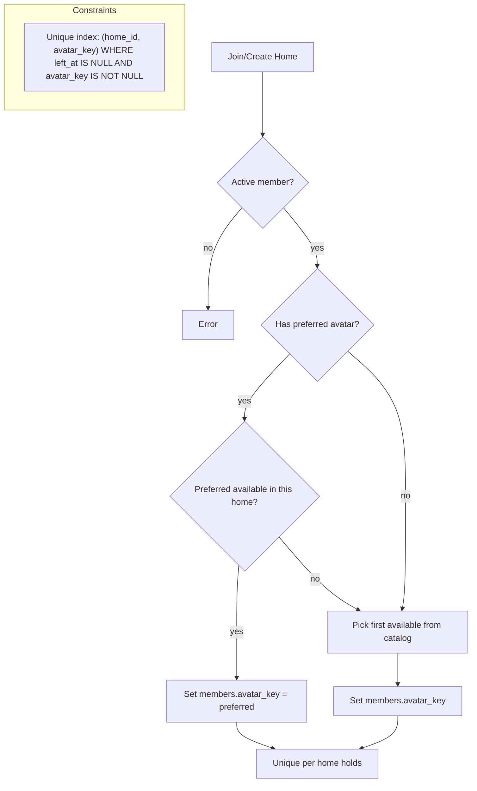

```mermaid
flowchart TD
  A[Join/Create Home] --> B{Active member?}
  B -- no --> X[Error]
  B -- yes --> C{Has preferred avatar?}
  C -- yes --> D{Preferred available in this home?}
  D -- yes --> E[Set members.avatar_key = preferred]
  D -- no --> F[Pick first available from catalog]
  C -- no --> F
  F --> G[Set members.avatar_key]
  E --> H[Unique per home holds]
  G --> H

  subgraph Constraints
    I["Unique index: (home_id, avatar_key) WHERE left_at IS NULL AND avatar_key IS NOT NULL"]
  end
```

